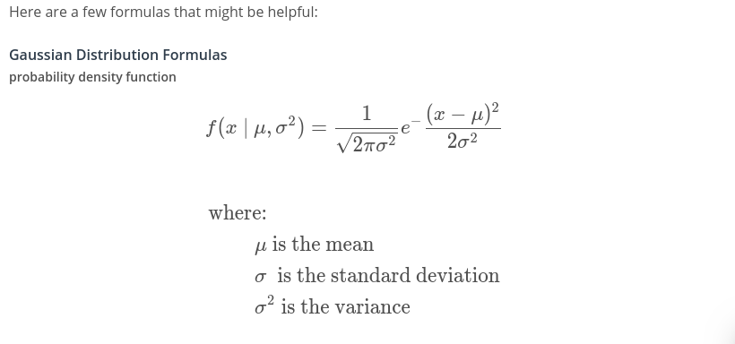
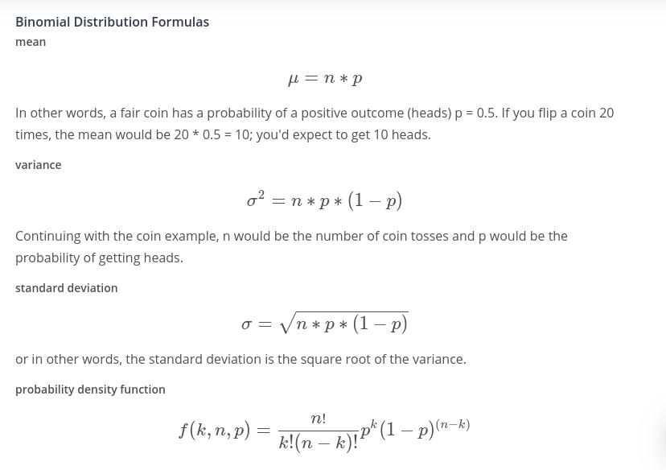

# distributions_gb001

distributions_gb001 is a Python package  for calculating and visualizing a Gaussian distribution and binomial distribution.

## Description

What you can do with the package:
        for Gaussian distribution and binomial distribution

    -   calculate mean and standard deviation.
    -   calculate Probability density function
    -   plot and visualize the normalized histogram of the data and a plot of the probability density
        function along the same range or bar probability density function of a binomial distribution
    -   add together two Gaussian or Binomial distributions

## Images




## Installation

Use the package manager [pip](https://pip.pypa.io/en/stable/) to install distributions_gb001.

```bash
pip install distributions_gb001
```

## Dependency

- matplotlib (to visualize plotted histogram/bar)

```bash
pip install matplotlib
```

## Usage

```python
import distributions_gb001

- without data file

gaussian_one = distributions_gb001.Gaussian(22, 3)
binomial_one = distributions_gb001.Binomial(.9, 20)
gaussian_one.mean # returns 22
binomial_one.stdev # returns 1.3416407864998736
gaussian_one + gaussian_one # returns 'mean 44, standard deviation 4.242640687119285'

- with data file

gaussian_two = distributions_gb001.Gaussian()
gaussian_two.read_data_file("/home/myname/Desktop/numbers.txt") 
 # read in data from a txt file

gaussian_two.calculate_mean() # calculate mean
gaussian_two.mean # returns mean value

gaussian_two.calculate_stdev(sample=True)    # calculate standard deviation ...... 
"""note -sample (bool): whether the data represents a sample or population which is 
set to True as default""" 
gaussian_two.stdev # returns standard deviation value

gaussian_two.pdf(x) # returns Probability density function output
"""x (float): point for calculating the probability density function"""

gaussian_two.plot_histogram_pdf(n_spaces = 50)
 # visualize normalized histogram with your set spaces
"""n_spaces (int): number of data points which is set to 50 as default"""


binomial_two = distributions_gb001.Binomial()
binomial_two.read_data_file("/home/myname/Desktop/numbers_bin.txt")
 # read in data from a txt file

binomial_two.calculate_mean() # calculate mean
binomial_two.mean # returns mean value

binomial_two.calculate_stdev()    # calculate standard deviation ...... 
binomial_two.stdev # returns standard deviation value

binomial_two.replace_stats_with_data() 
# to get new mean and standard deviation from the data set
""" by default --- mean = 10.0
                   standard deviation = 2.23606797749979"""
binomial_two.mean # returns new mean value
binomial_two.stdev # returns new standard deviation value

binomial_two.pdf(k) # returns Probability density function output
"""k (integer): point for calculating the probability density function"""

binomial_two.plot_bar_pdf() # visualize normalized histogram with your set spaces
"""n_spaces (int): number of data points which is set to 50 as default"""


""""Note : make sure "matplotlib" is installed" to visualize""" 
""""Note : to provide GUI backend to show figures, make sure python Tkinter 
is installed - for linux/ubuntu --- sudo apt install python3-tk""" 
```

## Author
Abeeb Ridwan Olumide

## Contributing
Pull requests are welcome. For major changes, please open an issue first to
discuss what you would like to change.

Please make sure to update tests as appropriate.

## License
[MIT](license)
